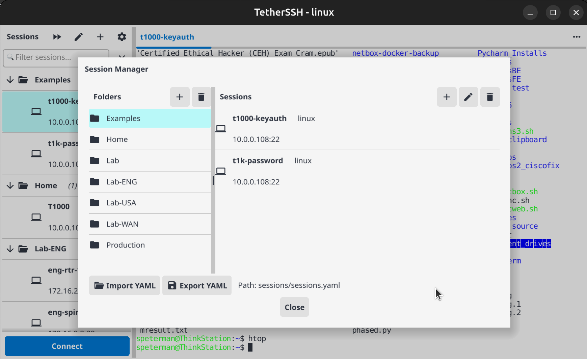
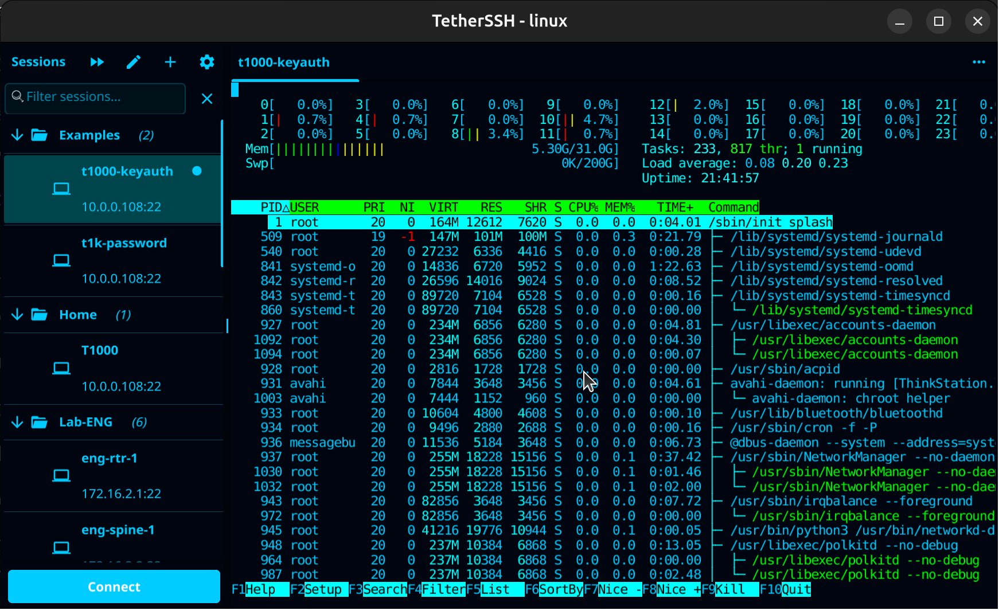
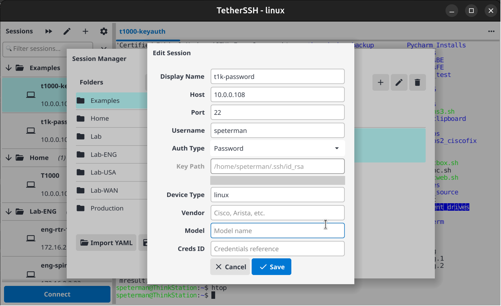

# TetherSSH - SSH Terminal Emulator

A Go-based SSH terminal emulator with session management, built on Fyne 2 GUI framework and the gopyte terminal emulation library.

The first fully-functional Fyne-based SSH terminal with session management, scrollback history, and text selection.

## Screenshots

### Session Manager with Tree View


Hierarchical folder/session tree with search filter, connection status indicators, and multi-tab interface

### Full-Screen Applications


htop running with full 256-color support, proper resize handling, and alternate screen buffer

### Session Editor


CRUD interface for managing sessions and folders with full authentication configuration

---

## Current Status: Alpha (v0.2.0)

### Working

- SSH connectivity with password and public key authentication
- Multi-tab terminal interface with tree-based session navigator
- Full terminal emulation via gopyte (VT100/ANSI parsing)
- Keyboard input routing to SSH sessions
- Dynamic terminal resize with proper SSH window-change signaling
- Full-screen applications (htop, vim, nano, etc.)
- 256-color support with proper color mapping
- Scrollback history (1000+ lines) with mouse wheel scrolling
- Text selection with clipboard support (double-click word, triple-click line)
- Tree-based session navigator with collapsible folders
- Session persistence via YAML configuration
- Session search/filter for quick access to devices
- Session editor with full CRUD operations
- Quick Connect dialog for ad-hoc connections
- SSH key authentication with encrypted key support
- Settings dialog with persistent configuration

### Known Issues

- UI freezes on application close (cleanup race condition) - partially fixed
- SSH agent support not fully implemented
- Host key verification not yet implemented

---

## Key Features

### Terminal Emulation

TetherSSH uses gopyte, a custom terminal emulation library written specifically for this project. Unlike the Fyne project's proof-of-concept terminal, gopyte provides:

- Full history buffer with configurable scrollback (default 1000 lines)
- Wide character support for CJK characters and emojis
- Alternate screen buffer for full-screen applications (vim, htop, less)
- Proper resize handling that syncs local screen, gopyte buffers, and SSH session

### Session Management

- Tree-based navigator with collapsible folders and session counts
- Real-time search/filter - instantly find sessions by name, host, group, or device type
- Multiple concurrent SSH connections in tabs
- Visual connection status indicators
- One-click connect with automatic credential handling

### Authentication Support

- Password authentication - prompted on connect or stored in session
- SSH key authentication - supports RSA, ECDSA, Ed25519 keys
- Encrypted key support - passphrase prompts for protected keys
- Keyboard-interactive - for MFA/RADIUS environments (including YubiKey)
- Configurable per-session authentication type

### Quick Connect

Press the fast-forward button for ad-hoc connections without saving a session:

- Enter host, port, username
- Choose Password or SSH Key authentication
- Default key path: ~/.ssh/id_rsa
- Optional key passphrase for encrypted keys

### Session Editor

Press the gear button to open the full session manager:

- Folders panel - organize sessions into groups
- Sessions panel - view/edit sessions in selected folder
- Add/Edit/Delete - full CRUD operations
- Import - load sessions from other YAML files
- Export - save current configuration
- Device metadata fields (type, vendor, model) for network equipment

### Session Persistence

Sessions are stored in `./sessions/sessions.yaml` (relative to app directory):

```yaml
# TetherSSH Sessions File
# Auth types: password, publickey, keyboard-interactive

- folder_name: Production
  sessions:
    - display_name: web-server-01
      host: 10.0.1.10
      port: "22"
      username: admin
      auth_type: publickey
      key_path: ~/.ssh/id_rsa
      DeviceType: linux

- folder_name: Lab
  sessions:
    - display_name: cisco-router
      host: 172.16.1.1
      port: "22"
      username: admin
      auth_type: password
      DeviceType: cisco_ios
      Vendor: Cisco
```

---

## Settings

Press the gear icon in the toolbar to open the Settings dialog. Settings are persisted to `./settings.json`.

### Terminal Tab

| Setting | Description | Default |
|---------|-------------|---------|
| Row Offset | Adjust terminal row calculation (increase for Retina/HiDPI displays) | 2 |
| Column Offset | Adjust terminal column calculation | 0 |
| Font Size | Terminal font size in points (not yet implemented) | 12 |
| Scrollback Lines | History buffer size (not yet implemented) | 1000 |
| Copy on Select | Auto-copy selected text to clipboard (not yet implemented) | Off |

### Appearance Tab

| Setting | Description | Default |
|---------|-------------|---------|
| Dark Theme | Toggle dark/light theme | On |
| Remember Window Size | Restore window dimensions on startup | On |

### SSH Tab (not yet implemented)

| Setting | Description | Default |
|---------|-------------|---------|
| Default SSH Key | Default key path for new sessions | ~/.ssh/id_rsa |
| Default Port | Default SSH port | 22 |
| Default Username | Pre-fill username for new sessions | (empty) |
| Connection Timeout | SSH connection timeout in seconds | 30 |
| Keepalive Interval | SSH keepalive interval in seconds | 60 |

### Logging Tab (not yet implemented)

| Setting | Description | Default |
|---------|-------------|---------|
| Enable Logging | Write session output to log files | Off |
| Log Directory | Directory for session logs | ./logs |
| Timestamp Logs | Prefix log entries with timestamps | On |

Log filename format: `{session_name}_{YYYYMMDD_HHMMSS}.log`

---

## File Structure

```
tetherssh/
├── cli/
│   ├── main.go                  # Application entry, window setup
│   ├── session_manager.go       # Tree navigator, search, tab management
│   ├── session_persistence.go   # YAML load/save, SessionStore
│   ├── session_editor.go        # CRUD modal dialog
│   ├── settings.go              # Application settings dialog
│   ├── ssh_backend.go           # SSH client, auth chain, SSHTerminalWidget
│   ├── terminal_widget.go       # NativeTerminalWidget - core terminal UI
│   ├── terminal_pty.go          # Local PTY support, WriteToPTY, history
│   ├── terminal_events.go       # Keyboard/mouse event handling
│   ├── terminal_events_bus.go   # Event bus for terminal events
│   ├── terminal_display.go      # TextGrid rendering, viewport calculation
│   ├── terminal_selection.go    # Text selection and clipboard
│   ├── terminal_containers.go   # Custom container widgets
│   ├── theme.go                 # Fyne theme, color mappings
│   ├── pty_unix.go              # Unix PTY implementation
│   └── pty_windows.go           # Windows PTY implementation
├── internal/
│   └── gopyte/                  # Terminal emulation library
│       ├── screen.go            # Base screen buffer (NativeScreen)
│       ├── screen_interface.go  # Screen interface definitions
│       ├── history_screen.go    # Scrollback history management
│       ├── wide_char_screen.go  # Wide character support
│       ├── alternative_screen.go # Alternate screen buffer (vim, htop)
│       ├── streams.go           # ANSI escape sequence parser
│       ├── escape.go            # Escape sequence definitions
│       ├── control.go           # Control character handling
│       ├── graphics.go          # SGR/graphics attributes
│       ├── modes.go             # Terminal mode handling
│       ├── charset.go           # Character set support
│       └── gopyte_test/         # Test suite
├── screenshots/
│   ├── htop.png
│   ├── session_detail.png
│   └── session_manager.png
├── sessions/
│   └── sessions.yaml            # Session configuration
├── go.mod
├── go.sum
├── LICENSE
└── README.md
```
---

## Building

### Prerequisites

- Go 1.21 or later
- GCC compiler (required for CGO/OpenGL):
  - Windows: Install TDM-GCC from https://jmeubank.github.io/tdm-gcc/ (MinGW-w64 based)
  - Linux: `sudo apt install build-essential` (Debian/Ubuntu) or equivalent
  - macOS: `xcode-select --install`

### Development Build

```bash
# Linux/macOS - run directly
go run -tags='!windows' ./cli

# Linux/macOS - build with debug symbols
go build -tags='!windows' -o tetherssh ./cli

# Windows - run directly
go run ./cli

# Windows - build with debug symbols
go build -o tetherssh.exe ./cli
```

### Release Build (Recommended)

Stripped binaries are approximately 50% smaller with no debug symbols.

```bash
# Linux/macOS
go build -tags='!windows' -ldflags="-s -w" -o tetherssh ./cli

# Windows
go build -ldflags="-s -w" -o tetherssh.exe ./cli
```

### Cross-Compilation

Cross-compiling Fyne apps requires CGO, which complicates cross-builds. Build natively on each target platform, or use fyne-cross with Docker:

```bash
# Install fyne-cross
go install github.com/fyne-io/fyne-cross@latest

# Build for Windows from Linux/macOS
fyne-cross windows -arch=amd64 ./cli

# Build for Linux from macOS/Windows
fyne-cross linux -arch=amd64 ./cli
```

### Binary Sizes (typical)

| Build Type | Size |
|------------|------|
| Debug (full symbols) | ~53 MB |
| Release (stripped) | ~26 MB |
| Zipped release | ~12 MB |

### Dependencies

```
fyne.io/fyne/v2               # GUI framework
golang.org/x/crypto/ssh       # SSH client
github.com/creack/pty         # Local PTY (Unix)
github.com/mattn/go-runewidth # Wide character width calculation
github.com/google/uuid        # Tab/session unique IDs
gopkg.in/yaml.v3              # Session persistence
```

---

## Configuration

### Session File Location

TetherSSH looks for sessions in `./sessions/sessions.yaml` relative to the application directory. If not found, a stub file is created with example entries.

### Supported Auth Types

| YAML Value | Description |
|------------|-------------|
| `password` | Prompt for password on connect |
| `publickey` | Use SSH key from `key_path` |
| `keyboard-interactive` | MFA/RADIUS environments |

### Key Path Expansion

The `~` character is expanded to the user's home directory:

- `~/.ssh/id_rsa` becomes `/home/username/.ssh/id_rsa` (Linux)
- `~/.ssh/id_rsa` becomes `/Users/username/.ssh/id_rsa` (macOS)
- `~/.ssh/id_rsa` becomes `C:\Users\username\.ssh\id_rsa` (Windows)

---

## Roadmap

### Phase 1: Core Features (Complete)

- Fix vim/htop resize issues
- Implement resize callback pattern
- Post-connect resize sync
- Buffer bounds safety in gopyte
- Session persistence (YAML config)
- Public key authentication
- Encrypted key passphrase support
- Session search/filter
- Session editor with CRUD
- Quick Connect dialog
- Tree-based session navigator
- Settings dialog with persistence

### Phase 2: Stability (Current)

- Fix application close freeze completely
- Implement SSH agent support
- Add host key verification with known_hosts
- Clean up debug logging
- Cross-platform testing (Windows, Linux, macOS)

### Phase 3: Logging and Security

- Per-session logging (raw/timestamped output to file)
- Log viewer/browser
- Encrypted credentials manager (AES-256-GCM)
- Master password unlock flow
- Credential references in sessions (decouple passwords from YAML)

### Phase 4: Terminal Features

- Split panes (horizontal/vertical)
- Find in terminal output
- Clickable URLs
- Command snippets/macros

### Phase 5: Advanced

- SFTP file browser integration
- Port forwarding UI
- Jump host/proxy support
- Session import from PuTTY/SecureCRT

---

## gopyte Terminal Emulation

gopyte is a terminal emulation library built specifically for TetherSSH. It provides:

### Screen Hierarchy

- NativeScreen: Base screen buffer
- HistoryScreen: Adds scrollback history
- WideCharScreen: Adds wide character support and alternate screen buffer

### Key Features

- VT100/ANSI parsing via Stream.Feed()
- Scrollback history with linked list storage
- Alternate screen buffer for vim, htop, less, etc.
- Wide character support for CJK and emojis
- Resize handling that preserves content and history

### Escape Sequences Supported

- Cursor movement (CUP, CUU, CUD, CUF, CUB)
- Erase operations (ED, EL)
- SGR attributes (colors, bold, underline, etc.)
- Scroll regions (DECSTBM)
- Alternate screen (DECSET/DECRST 1049)
- Window title (OSC 0, 1, 2)

---

## Related Projects

- Secure Cartography: https://github.com/scottpeterman/secure_cartography - Network discovery and topology mapping
- TerminalTelemetry: https://pypi.org/project/terminaltelemetry/ - PyQt6-based SSH terminal with real-time monitoring
- VelociTerm: https://github.com/scottpeterman/velociterm - Web-based SSH terminal with NetBox integration

---

## License

MIT License - See LICENSE file

---

Last updated: November 30, 2025

Author: Scott Peterman